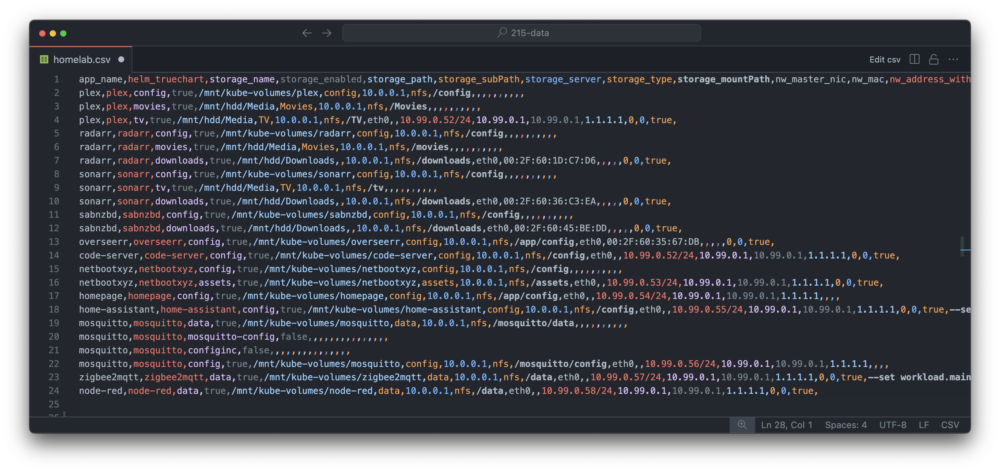
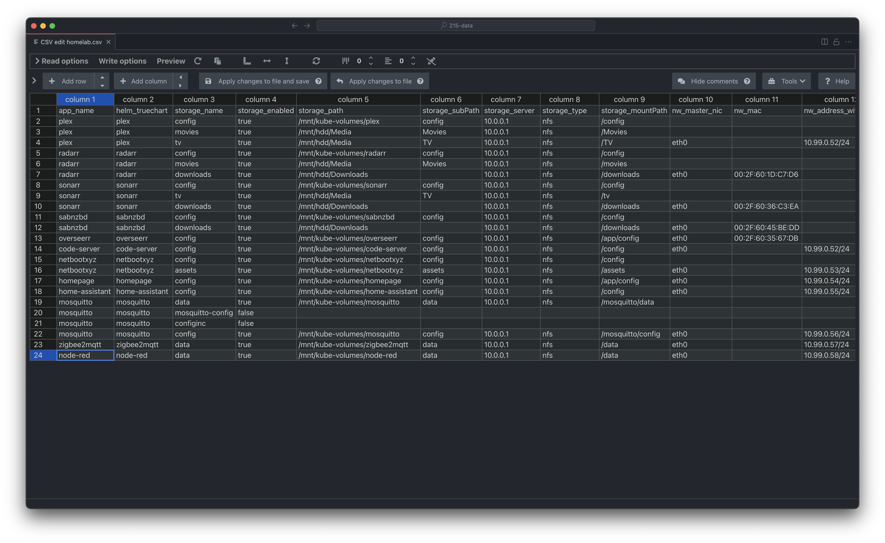
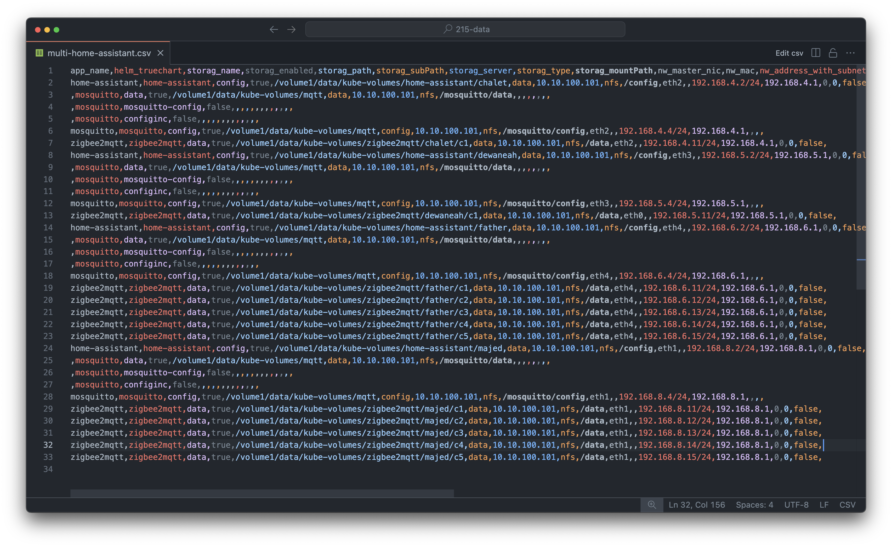
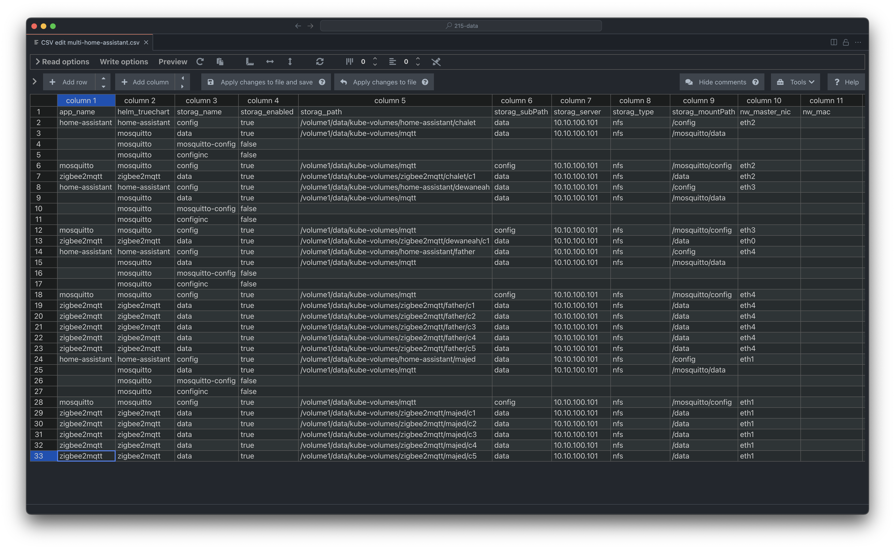

# kubecsv

The `kubecsv` script is a utility script runs on MacOS and Linux designed for easy installation of Kubernetes cluster and deploying apps from a simple csv file, deploy.csv (check examples) on set of Ubuntu 22.04 host(s). It has beeen tested on xcp-ng VMs and bare-metal.

## INPUT: `deploy.csv`

*csv file as an input. Step 4 in the script will autogenerate one for you, also you can find several csv files as example in `examples` folder of this repo*

## OUTPUT: k8s

*That's the result after the deployment of above homelab csv file*


## Helpers
This shell script is using:
1. **kubeadm** command: for kubernetes installation
2. **CNI**: Cluster's network is mainly based on CNI (Container Network Interface) plugins (`flannel`, `multis`, and `dhcp`), where the script downloads CNI plugins' binaries, run deamons, create overlay networks, and deploy other k8s resources for the purpose of creating cluster's, static and dhcp network interfaces
4. **kubectl** and **helm**: We are heavily using `kubectl` and `helm` commands for the managment and deployment of Kubernetes apps, network, storage, and other resources
5. **TrueCharts**: The source of most deployments (network and apps) are TrueCharts helm charts repository, where [all apps are defind](https://truecharts.org/charts/description-list/), their [spesefic default values](https://github.com/truecharts/charts/tree/master/charts), and their [common values](https://github.com/truecharts/library-charts/blob/main/library/common/values.yaml)
6. **k9s** CLI: `k9s` is a handy tool for monitoring the cluster's resources

> The script will download and run binaries (`helm`, `kubectl`, `jq` and `k9s`) in the bin folder where you are running the script.

## How To
### 1st:
Download the script
```
curl -fsSL https://raw.githubusercontent.com/alrokayan/kubecsv/main/kubecsv -o kubecsv
```

### 2ns:
Change script file permision
```
chmod +x kubecsv
```

### 3rd:
Run the script
```
./kubecsv
```

> You can send an OPTION as an input if you know what option to send (see OPTIONS section below). For example: `./kubecsv 4` generates an example csv file based on your answer to a set of questions about your infrastracture and archecture.

### 4th:
Then answer the inital questions to create the `.env` (if file doesn't exist)

### 5th:
Now you should see `kubecsv` interactive interface with menu of two main sections: Steps and Tools. From Steps section, run the steps `0` (`apt` uninstall), `1` (`apt` install), `2` (`kubeadm` init/join), `3` (`flannel` and `multus`), `4` (create `deploy.csv`), and `5` (deploy `deploy.csv`). Or `all` to run all steps in sequance *(WARNING: error handling is not implimented)*

## Edit CSV
The best way to edit csv is via a CSV Edit extention in Studio Code, or alterativlly: MS Excel, Google Sheets (import as csv, export as csv), or just a csv coloroing extention in Studio Code.


*That's how the csv file looks like openning it with janisdd.vscode-edit-csv*

## CSV Columns
The file must be named `deploy.csv` and put in the same directory where you are ruuning `kubecsv`. The CSV columns description are:

1. `app_name`: This column hold a the app name, you can put any
2. `helm_truechart`: This column holds the app helm chart name from this [link](https://truecharts.org/charts/description-list/)
3. `storage_name`: This column contains the name of the storage. It can be any, however, some times you want to overwrite a named storage. You can see all named storages from the values.yaml in [TrueCharts github repo](https://github.com/truecharts/charts/tree/master/charts)
4. `storage_enabled`: This column is to disable a named storage *(OPTIONAL)*
5. `storage_path`: This column contains the NFS path of the app 
6. `storage_subPath`: This column contains the sub path follows the `storage_enabled`. As a best practise, it's better to name the `storage_subPath` as `storage_name` *(OPTIONAL)*
7. `storage_server`: This column for NFS server
8.  `storage_type`: This column to indicate the storage type, for now it has been tested on `nfs` only 
9.  `storage_mountPath`: This column contains the path of data/config inside the container
10. `nw_master_nic`: This column for MacVLAN (dhcp or static ip) master/parent network interface
11. `nw_mac`: This column to fix the MAC addreess of the app, useful for dhcp to assign fixed ip from the dhcp server
12. `nw_address_with_subnet`: This column is optional. If you assign an IP/CIDR value `kubecsv` will attach a static IP, if left empty it will use dhcp *(OPTIONAL)*
13. `nw_gateway`: This column is needed only if you assign fixed IP in `nw_address_with_subnet`. It holds the gateway for the provided fix ip. *(OPTIONAL)*
14. `nw_dns1`: This column is needed only if you assign fixed IP in `nw_address_with_subnet`. It holds DNS server one *(OPTIONAL)*
15. `nw_dns2`: This column is needed only if you assign fixed IP in `nw_address_with_subnet`. It holds DNS server two *(OPTIONAL)*
16. `run_as_user`: This column is optional too if you want to set a UID for the app to run as *(OPTIONAL)*
17. `run_as_group`: This column is optional too if you want to set a GID for the app to run as *(OPTIONAL)*
18. `privileged`: This column contains true or false. true means the app will run in a `privileged` mode. Default is false *(OPTIONAL)*
19. `extra_helm_values`: This column contains any extra values you want to add in a form of `--set key:value` *(OPTIONAL)*

## TrueChart Charts
`kubecsv` supports almost all of the 700+ TrueCharts charts. You can view them here: https://truecharts.org/charts/description-list/

## OPTIONS:
- `./kubecsv` will an interactive script with a set of tools, where you can choose to deploy and step and or run any of the tools (interactive)
- `./kubecsv 0` will run step 0 (uninstalling), see details below (non-interactive)
- `./kubecsv 1` will run step 1 (installing), see details below (non-interactive)
- `./kubecsv 2` will run step 2 (create the cluster), see details below (non-interactive)
- `./kubecsv 3` will run step 3 (deploy k8s network), see details below (non-interactive)
- `./kubecsv 4` will run step 4 (generate an example deploy.csv), see details below (non-interactive)
- `./kubecsv 5` will run step 5 (deploy deploy.csv), see details below (non-interactive)
- `./kubecsv all` will run the steps 0 to 5, one by one *(WARNING: error handling is not implimented) (non-interactive)*
- `./kubecsv un3` Will undoes the actions performed in steps 3 and 5, effectively removing all applications and the Kubernetes network configuration (non-interactive)
- `./kubecsv un5` Will specifically targets the undoing of step 5, removing all applications deployed from the `deploy.csv` without affecting the network configuration (non-interactive)
- `./kubecsv k` Will run k9s monitoring tool using the configured kubeconfig (interactive)

## .env
On the first run of the `kubecsv`, the `.env` file (if doesn't exist), will he created by answering a set of questions regarding the cluster nodes, their ssh access, and Kubernetes network CIDR. The script will update `.env` during the execution of step `1` to add the the Kubernetes version enviroment varibales. Also on step `4` to save the template values for the example `deploy.csv` file.

Also the `.env` file will be updated once more on running network dignostic tool pod; to save the pod's network configurations for future quick-run

## Logs
Every time you run the script, a `logs` folder will be created (if it doesn't exist) with your current and past logs

## kubecsv Steps
The scrpt is devided into six distinguished steps as following:

### Step 0: Uninstall Everything
> This step involves cleaning up or uninstalling all components related to the Kubernetes cluster that were previously installed or configured by this script. It might include removing installed packages, deleting configuration files, and cleaning up any temporary files created during the process.

### Step 1: Prepare Hosts and Install Pre-requisites
> Executes necessary commands to prepare the host machines for Kubernetes installation. This includes updating package lists, installing required packages via `apt`, and possibly setting up necessary system configurations.

### Step 2: Create Kubernetes Cluster
> Initializes a Kubernetes cluster using `kubeadm init`. This step sets up the control plane and prepares the cluster for adding worker nodes. and execute `kubeadm join` command on the workers nodes.

### Step 3: Deploy Kubernetes Network
> Deploys networking solutions within the Kubernetes cluster, specifically mentioning `flannel` and `multus`. Flannel is a simple and easy-to-configure layer 3 network fabric designed for Kubernetes, while Multus is a CNI plugin that enables attaching multiple network interfaces to pods.

### Step 4: Generate `deploy.csv`
> Generates a CSV file named `deploy.csv`, which contains configuration or deployment specifications for applications or services to be deployed within the cluster. You can see it as a template or sample file for users to customize.

### Step 5: Deploy `deploy.csv`
> Takes the previously generated (or provided) `deploy.csv` file and deploys its contents to the Kubernetes cluster. This step involve parsing the CSV file and applying the configurations it contains, such as deploying applications, storage and network.

You can run those above steps using one of four ways:
1. `./kubecsv` then go throw the steps from `0` to `5` by selecting the step number from `kubecsv` CLI main menu (recommended)
2. `./kubecsv` then selecting `all` from `kubecsv` CLI main menu, this option will go throw the steps from `0` to `5` by automaticlly
3. `./kubecsv 0` or `./kubecsv 1` or `./kubecsv 2` or `./kubecsv 3` or `./kubecsv 4` or `./kubecsv 5` where the script will skip `kubecsv` CLI interactive main menu to execute the inputed step number
4. `./kubecsv all` this option will go throw the steps from `0` to `5` by automaticlly skipping `kubecsv` CLI interactive main menu

## kubecsv Tools
In addition to the above six steps and the option to run `all` of them at once; you have the tollowing tools at your disposal:
- network tools pod for network and dns dignoatic
- k9s CLI to monitor the cluster
- dns fix to update the cluster's configurtion with the current DNS pods' IP address(es)
- install `kubectl`, `helm`, `k9s`, and `jq` binaries (MacOS or Linux) into a bin folder where `kubecsv` script is running
- rebooting all nodes

## Requirements
Mac or Linux as a local machine (the machine that will run the script). Regarding the hosts (nodes) `kubecsv` script has been tested on Ubuntu 22.04 VM and bare-metal. The script works for one node or multiple. Please check `kubeadm` minmume requirments.

## Example
### 1. Multiple Home Assistant
With this script you can deploy multiple home-assistant and multiple zigbee2mqtt and multiple mqtt brokers, each with a fix IP or dhcp-assigned IP in the same cluster. Storage is nfs for now.


*A deployment csv file to deploy multiple home-assistant, multiple zigbee2mqtt, and multiple mqtt brokers with dhcp and static ip*


*That's how the csv file looks like openning it with janisdd.vscode-edit-csv*

### 2. Homelab
The script takes a reading from [truecharts helm charts](https://truecharts.org/charts/description-list/) and deploy them. You can set static IP or dhcp IP with fixed MAC address all within the csv file.


*A deployment csv file to deploy a set of homelab apps with dhcp and static ip*


*That's how the csv file looks like openning it with janisdd.vscode-edit-csv*


*That's the result after deployment of homelab csv file*

## Useful links:
1. **TrueChartsApps List**: https://truecharts.org/charts/description-list/
2. **TrueCharts Apps Values**: https://github.com/truecharts/charts/tree/master/charts
3. **TrueCharts All Apps Common Values**: https://github.com/truecharts/library-charts/blob/main/library/common/values.yaml

## TL;DR
```
curl -fsSL https://raw.githubusercontent.com/alrokayan/kubecsv/main/kubecsv -o kubecsv && chmod +x kubecsv && ./kubecsv all
```

---
> [Apache kubecsv](https://github.com/alrokayan/kubecsv)
> Copyright 2024 The Apache Software Foundation
> 
> This product includes software developed at
> The Apache Software Foundation (http://www.apache.org/).
