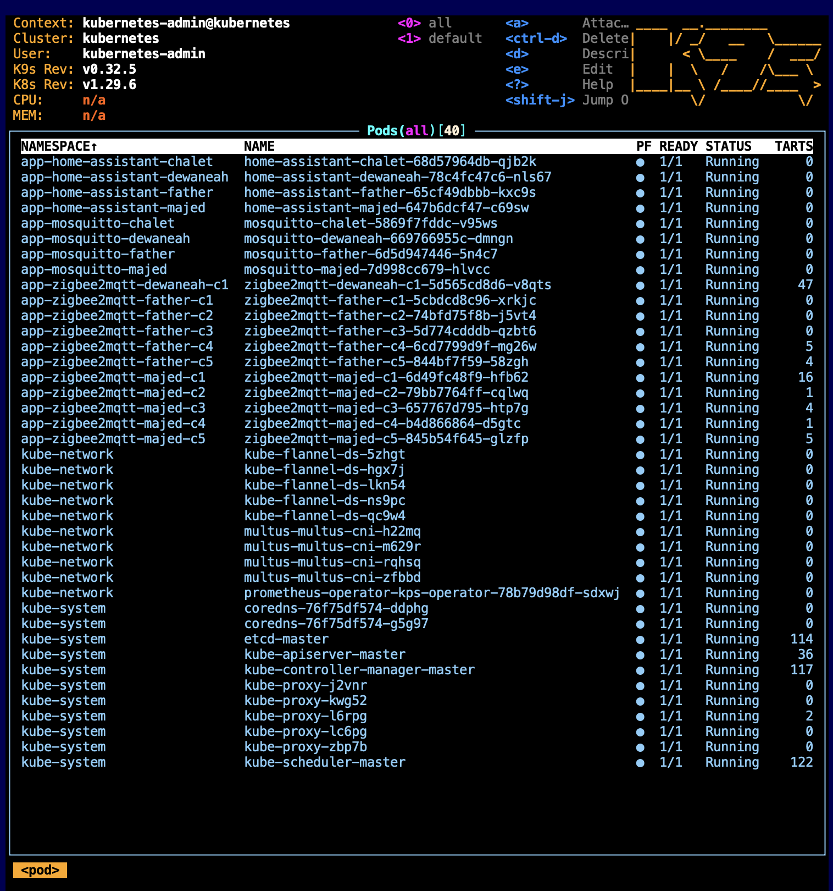

# `kubecsv`
`kubecsv` is a bash script that deploys a set of apps including their storage and network from a single comma-separated values (csv) file using TrueCharts helm repo.

---
## HOW TO USE `kubecsv` ?
Create a csv file following `CSV Columns` section below or copy and edit one of the `examples` in this repo. Then run below command in Linux or macOS. Replace `/path/to/file.csv` with yours.
```
curl -fsSL https://raw.githubusercontent.com/alrokayan/scripts/main/disk-test.sh | bash -s -- /path/to/file.csv
```

---
## EDIT CSV
The best way to edit csv is via a CSV Edit extension in Studio Code, or alteratively: MS Excel, Google Sheets (import as csv, export as csv), or just a csv coloring extention in Studio Code.


*That's how the csv file looks like opening it with janisdd.vscode-edit-csv*

---
## CSV Columns
The file must be named `deploy.csv` and put in the same directory where you are ruining `kubecsv`. The CSV columns description are:

1. `app_name`: This column hold a the app name, you can put any
2. `helm_truechart`: This column holds the app helm chart name from this [link](https://truecharts.org/charts/description-list/)
3. `storage_name`: This column contains the name of the storage. It can be any, however, some times you want to overwrite a named storage. You can see all named storages from the values.yaml in [TrueCharts github repo](https://github.com/truecharts/charts/tree/master/charts)
4. `storage_enabled`: This column is to disable a named storage *(OPTIONAL)*
5. `storage_path`: This column contains the NFS path of the app 
6. `storage_subPath`: This column contains the sub path follows the `storage_enabled`. As a best practise, it's better to name the `storage_subPath` as `storage_name` *(OPTIONAL)*
7. `storage_server`: This column for NFS server
8.  `storage_type`: This column to indicate the storage type, for now it has been tested on `nfs` only 
9.  `storage_mountPath`: This column contains the path of data/config inside the container
10. `nw_master_nic`: This column for MacVLAN (dhcp or static ip) master/parent network interface
11. `nw_mac`: This column to fix the MAC address of the app, useful for dhcp to assign fixed ip from the dhcp server
12. `nw_address_with_subnet`: This column is optional. If you assign an IP/CIDR value `kubecsv` will attach a static IP, if left empty it will use dhcp *(OPTIONAL)*
13. `nw_gateway`: This column is needed only if you assign fixed IP in `nw_address_with_subnet`. It holds the gateway for the provided fix ip. *(OPTIONAL)*
14. `nw_dns1`: This column is needed only if you assign fixed IP in `nw_address_with_subnet`. It holds DNS server one *(OPTIONAL)*
15. `nw_dns2`: This column is needed only if you assign fixed IP in `nw_address_with_subnet`. It holds DNS server two *(OPTIONAL)*
16. `run_as_user`: This column is optional too if you want to set a UID for the app to run as *(OPTIONAL)*
17. `run_as_group`: This column is optional too if you want to set a GID for the app to run as *(OPTIONAL)*
18. `privileged`: This column contains true or false. true means the app will run in a `privileged` mode. Default is false *(OPTIONAL)*
19. `extra_helm_values`: This column contains any extra values you want to add in a form of `--set key:value` *(OPTIONAL)*

---
## EXAMPLES

### 1. Multiple Home Assistant
With this script you can deploy multiple home-assistant and multiple zigbee2mqtt and multiple mqtt brokers, each with a fix IP or dhcp-assigned IP in the same cluster. Storage is nfs for now.


*A deployment csv file to deploy multiple home-assistant, multiple zigbee2mqtt, and multiple mqtt brokers on multiple network interfaces with dhcp and/or static ip*


*That's how the csv file looks like opening it with janisdd.vscode-edit-csv*


*That's the result after deployment of `multi-home-assistant-dhcp.csv` or `multi-home-assistant-static.csv` file*

### 2. Homelab
The script takes a reading from [TrueCharts helm charts](https://truecharts.org/charts/description-list/) and deploy them. You can set static IP or dhcp IP with fixed MAC address all within the csv file.


*A deployment csv file to deploy a set of homelab apps with dhcp and static ip*


*That's how the csv file looks like opening it with janisdd.vscode-edit-csv*


*That's the result after deployment of `homelab-dhcp.csv` or `homelab-static.csv` file*

---
## USEFUL LINKS:
1. **TrueCharts Apps List**: https://truecharts.org/charts/description-list/
2. **TrueCharts Apps Values**: https://github.com/truecharts/charts/tree/master/charts
3. **TrueCharts Apps Common Values**: https://github.com/truecharts/library-charts/blob/main/library/common/values.yaml
