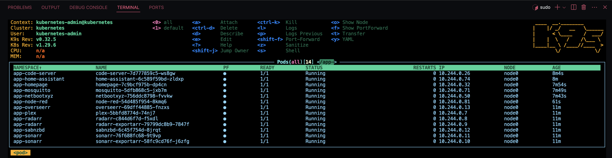
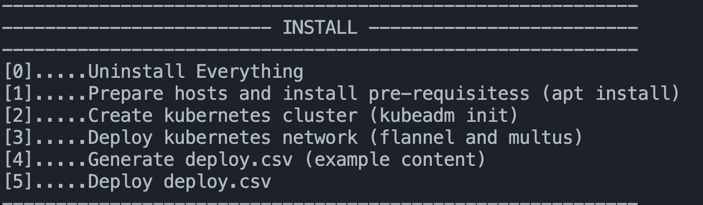
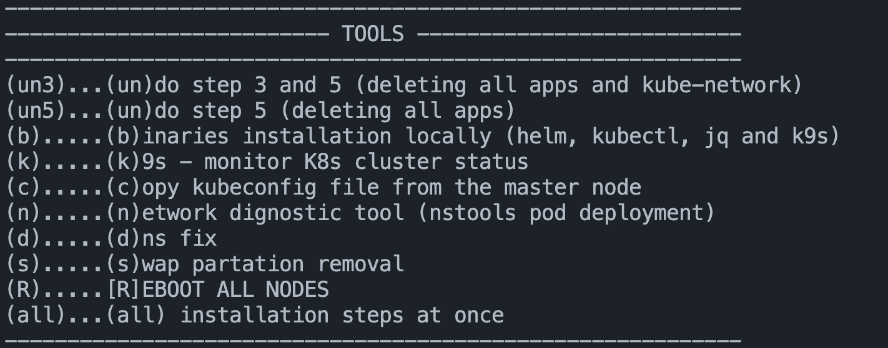

# `kubecsv`
`kubecsv` provides one of the simplest method to create multiple-networks, multiple-home-assistant, multiple-zigbee2mqtt, and multiple-mosquitto in a Kubernetes' cluster to eventually the script deploy a static and dhcp-based pods' network interface.

`kubecsv` runs on macOS and Linux. Cluster's nodes/hosts are running Ubuntu 22.04 (amd64)

`kubecsv` script designed for an easy installation of Kubernetes cluster and deploying a set of apps and their storage and network from a single comma-separated values (csv) file, `deploy.csv`, (check the `examples` folder) on set of Ubuntu 22.04 host(s). It has been tested on 7-node xcp-ng VMs with multiple VLAN-based network interfaces and a single bare-metal. Each container has two network interfaces (one interface goes direct to a nas)

> *Instructions on downloading and using the script are in section "HOW TO" below. The script will *autogenerate* one for you based on a set of Q/A at the very beginning of script. Step 2 and network diagnostic tool will add more env values.*

### INPUT: `deploy.csv`

*`deploy.csv` is a csv file as an input. Step `4` in the script will *autogenerate* one for you based on a set of questionnaires, also you can find several csv files as example in `examples` folder of this repo*

### OUTPUT: k8s

*That's the result after the deployment of `homelab.csv` file (the csv file must be renamed to `deploy.csv` and moved to the same directory where the `kubecsv` script is running)*

---
## HOW TO CREATE A K8S CLUSTER AND DEPLOY APPS?

### 1) Download the script
```
git clone https://github.com/alrokayan/kubecsv.git
cd kubecsv
```
or
```
mkdir kubecsv
cd kubecsv
curl -fsSL https://raw.githubusercontent.com/alrokayan/kubecsv/main/kubecsv -o kubecsv
```
### 2) Change script file permission
```
chmod +x kubecsv
```
### 3) Run the script
```
./kubecsv
```
> You can send an OPTION as an input if you know what option to send (see OPTIONS section below). For example: `./kubecsv 4` generates an example csv file based on your answer to a set of questions about your infrastructure and architecture.

### 4) `.env` file creation
Then answer the initial questions to create the `.env` (if file doesn't exist). Now you should see `kubecsv` interactive interface with menu of two main sections: *INSTALLATION STEPS* and *TOOLS*.

To create a Kubernetes follow the sequence of steps from `0` to `5` in the *INSTALLATION STEPS* section, run the steps `0` (`apt` uninstall), `1` (`apt` install), `2` (`kubeadm` init/join), `3` (`flannel` and `multus`), `4` (create `deploy.csv`), and `5` (deploy `deploy.csv`). Or `all` to run all steps in sequence *(WARNING: error handling is not implemented)*

### 5) INSTALLATION STEP `0`
This step clean up and uninstall all components related to the Kubernetes cluster that were previously installed or configured by this script. It might include removing installed packages, deleting configuration files, and cleaning up any temporary files created during the process.

### 6) INSTALLATION STEP `1`
This step executes necessary commands to prepare the host machines for Kubernetes installation. This includes updating package lists, installing required packages via `apt`, and possibly setting up necessary system configurations.

### 7) INSTALLATION STEP `2`
This step initializes a Kubernetes cluster using `kubeadm init`. This step sets up the control plane and prepares the cluster for adding worker nodes. and execute `kubeadm join` command on the workers nodes.

### 8) INSTALLATION STEP `3`
This step deploy networking solutions within the Kubernetes cluster, specifically mentioning `flannel` and `multus`. Flannel is a simple and easy-to-configure layer 3 network fabric designed for Kubernetes, while Multus is a CNI plugin that enables attaching multiple network interfaces to pods.

### 9) INSTALLATION STEP `4`
This step generate a CSV file named `deploy.csv`, which contains configuration or deployment specifications for applications or services to be deployed within the cluster. You can see it as a template or sample file for users to customize.

### 10) INSTALLATION STEP `5`
This step takes the previously generated (or provided) `deploy.csv` file and deploys its contents to the Kubernetes cluster. This step involve parsing the CSV file and applying the configurations it contains, such as deploying applications, storage and network.

---
## EDIT CSV
The best way to edit csv is via a CSV Edit extension in Studio Code, or alteratively: MS Excel, Google Sheets (import as csv, export as csv), or just a csv coloring extention in Studio Code.


*That's how the csv file looks like opening it with janisdd.vscode-edit-csv*

---
## CSV Columns
The file must be named `deploy.csv` and put in the same directory where you are ruining `kubecsv`. The CSV columns description are:

1. `app_name`: This column hold a the app name, you can put any
2. `helm_truechart`: This column holds the app helm chart name from this [link](https://truecharts.org/charts/description-list/)
3. `storage_name`: This column contains the name of the storage. It can be any, however, some times you want to overwrite a named storage. You can see all named storages from the values.yaml in [TrueCharts github repo](https://github.com/truecharts/charts/tree/master/charts)
4. `storage_enabled`: This column is to disable a named storage *(OPTIONAL)*
5. `storage_path`: This column contains the NFS path of the app 
6. `storage_subPath`: This column contains the sub path follows the `storage_enabled`. As a best practise, it's better to name the `storage_subPath` as `storage_name` *(OPTIONAL)*
7. `storage_server`: This column for NFS server
8.  `storage_type`: This column to indicate the storage type, for now it has been tested on `nfs` only 
9.  `storage_mountPath`: This column contains the path of data/config inside the container
10. `nw_master_nic`: This column for MacVLAN (dhcp or static ip) master/parent network interface
11. `nw_mac`: This column to fix the MAC address of the app, useful for dhcp to assign fixed ip from the dhcp server
12. `nw_address_with_subnet`: This column is optional. If you assign an IP/CIDR value `kubecsv` will attach a static IP, if left empty it will use dhcp *(OPTIONAL)*
13. `nw_gateway`: This column is needed only if you assign fixed IP in `nw_address_with_subnet`. It holds the gateway for the provided fix ip. *(OPTIONAL)*
14. `nw_dns1`: This column is needed only if you assign fixed IP in `nw_address_with_subnet`. It holds DNS server one *(OPTIONAL)*
15. `nw_dns2`: This column is needed only if you assign fixed IP in `nw_address_with_subnet`. It holds DNS server two *(OPTIONAL)*
16. `run_as_user`: This column is optional too if you want to set a UID for the app to run as *(OPTIONAL)*
17. `run_as_group`: This column is optional too if you want to set a GID for the app to run as *(OPTIONAL)*
18. `privileged`: This column contains true or false. true means the app will run in a `privileged` mode. Default is false *(OPTIONAL)*
19. `extra_helm_values`: This column contains any extra values you want to add in a form of `--set key:value` *(OPTIONAL)*

---
## HELPERS
This shell script is using:
1. **kubeadm**: `Kubeadm` is a tool built to provide `kubeadm` init and `kubeadm` join as best-practice "fast paths" for creating Kubernetes clusters
2. **CNI**: `kubecsv` script deploys apps' static IP and dhcp networks based on `flannel`, `multis`, and `dhcp` CNI (Container Network Interface) plugins. `kubecsv` downloads CNI plugin binaries, run CNI plugin daemons, create CNI plugin overlay networks
3. **kubectl** and **helm**: `kubecsv` script is using `kubectl` and `helm` commands for the deployment of Kubernetes apps and network
4. **TrueCharts**: TrueCharts is a helm repository for all apps/charts deployed by `kubecsv` the source of most apps chart, where a comprehensive list of TrueCharts apps can be found [here](https://truecharts.org/charts/description-list/), and their [app-specific helm values](https://github.com/truecharts/charts/tree/master/charts), and their [common helm values](https://github.com/truecharts/library-charts/blob/main/library/common/values.yaml)
5. **k9s**: `k9s` is a CLI tool for monitoring a Kubernetes cluster
> The script will download and run binaries (`helm`, `kubectl`, `jq` and `k9s`) in the bin folder where you are running the script.

---
## OPTIONS
- `./kubecsv` will an interactive script with a set of tools, where you can choose to deploy and step and or run any of the tools *(interactive)*
- `./kubecsv 0` will run step `0` (uninstalling), see details below *(non-interactive)*
- `./kubecsv 1` will run step `1` (installing), see details below *(non-interactive)*
- `./kubecsv 2` will run step `2` (create the cluster), see details below *(non-interactive)*
- `./kubecsv 3` will run step `3` (deploy k8s network), see details below *(non-interactive)*
- `./kubecsv 4` will run step `4` (generate an example `deploy.csv`), see details below *(non-interactive)*
- `./kubecsv 5` will run step `5` (deploy `deploy.csv`), see details below *(non-interactive)*
- `./kubecsv all` will run the steps `0` to `5`, one by one *(WARNING: error handling is not implemented) *(non-interactive)**
- `./kubecsv un3` Will undoes the actions performed in steps `3` and `5`, effectively removing all applications and the Kubernetes network configuration *(non-interactive)*
- `./kubecsv un5` Will specifically targets the undoing of step `5`, removing all applications deployed from the `deploy.csv` without affecting the network configuration *(non-interactive)*
- `./kubecsv k` Will run `k9s` monitoring tool using the configured `kubeconfig` *(interactive)*
- `./kubecsv c` will copy `kubeconfig` from the master node
- `./kubecsv n` will temporary deploy a network diagnostic tool (`nstools` pod)
- `./kubecsv b` will download `kubectl`, `helm`, `k9s`, and `jq` binaries (macOS or Linux) into a bin folder where `kubecsv` script is running
- `./kubecsv d` updating the cluster's configuration with the current DNS pods' IP address(es)
- `./kubecsv s` swap partition removal
- `./kubecsv R` reboot all nodes

---
## TrueChart CHARTS
`kubecsv` supports almost all of the 700+ TrueCharts charts. You can view them here: https://truecharts.org/charts/description-list/

---
## METHODS TO DEPLOY

**1. STEP-BY-STEP INTERACTIVE**
> `./kubecsv` then go throw the steps from `0` to `5` by selecting the step number from `kubecsv` CLI main menu (recommended)

**2. *ALL AT ONCE* INTERACTIVE**
> `./kubecsv` then select `all` from `kubecsv` CLI main menu, this option will go throw the steps from `0` to `5` by automatically

**3. STEP-BY-STEP NON-INTERACTIVE**
> `./kubecsv 0` or `./kubecsv 1` or `./kubecsv 2` or `./kubecsv 3` or `./kubecsv 4` or `./kubecsv 5` where the script will skip `kubecsv` CLI interactive main menu to execute the implanted step number

**4. *ALL AT ONCE* NON-INTERACTIVE**
> `./kubecsv all` this option will go throw the steps from `0` to `5` by automatically skipping `kubecsv` CLI interactive main menu

---
## `kubecsv` INSTALLATION STEPS


#### Step 0: Uninstall Everything
> This step involves cleaning up or uninstalling all components related to the Kubernetes cluster that were previously installed or configured by this script. It might include removing installed packages, deleting configuration files, and cleaning up any temporary files created during the process.

#### Step 1: Prepare Hosts and Install Pre-requisites
> Executes necessary commands to prepare the host machines for Kubernetes installation. This includes updating package lists, installing required packages via `apt`, and possibly setting up necessary system configurations.

#### Step 2: Create Kubernetes Cluster
> Initializes a Kubernetes cluster using `kubeadm init`. This step sets up the control plane and prepares the cluster for adding worker nodes. and execute `kubeadm join` command on the workers nodes.

#### Step 3: Deploy Kubernetes Network
> Deploys networking solutions within the Kubernetes cluster, specifically mentioning `flannel` and `multus`. Flannel is a simple and easy-to-configure layer 3 network fabric designed for Kubernetes, while Multus is a CNI plugin that enables attaching multiple network interfaces to pods.

#### Step 4: Generate `deploy.csv`
> Generates a CSV file named `deploy.csv`, which contains configuration or deployment specifications for applications or services to be deployed within the cluster. You can see it as a template or sample file for users to customize.

#### Step 5: Deploy `deploy.csv`
> Takes the previously generated (or provided) `deploy.csv` file and deploys its contents to the Kubernetes cluster. This step involve parsing the CSV file and applying the configurations it contains, such as deploying applications, storage and network.

---
## `kubecsv` TOOLS


In addition to the above six steps and the option to run `all` of them at once; you have the following tools at your disposal:
- Option `un3`: *un*do step `3` and `5` (deleting all deployed apps and network related resources)
- Option `un5`: *un*do step `5` (deleting all apps and keep network related resources)
- Option `b`: *b*inaries installation: download `kubectl`, `helm`, `k9s`, and `jq` binaries (macOS or Linux) into a bin folder where `kubecsv` script is running
- Option `k`: *k*9s: `k9s` CLI to monitor the cluster
- Option `c`: *c*opy `kubeconfig`: copying `kubeconfig` file from the master node
- Option `n`: *n*etwork diagnostic tool: `nstools` pod deployment
- Option `d`: *d*ns fix: updating the cluster's configuration with the current DNS pods' IP address(es)
- Option `s`: *s*wap partition removal
- Option `R`: *R*EBOOT ALL NODES

---
## `.env` FILE
On the first run of the `kubecsv`, the `.env` file (if doesn't exist), will he created by answering a set of questions regarding the cluster nodes, their ssh access, and Kubernetes network CIDR. The script will update `.env` during the execution of step `1` to add the the Kubernetes version environment variables. Also on step `4` to save the template values for the example `deploy.csv` file.

Also the `.env` file will be updated once more on running network diagnostic tool pod; to save the pod's network configurations for future quick-run

---
## LOGS
Every time you run the script, a `logs` folder will be created (if it doesn't exist) with your current and past logs

---
## SYSTEM REQUIREMENTS
Mac or Linux as a local machine to run `kubecsv` shell script. Regarding the hosts (nodes) `kubecsv` script has been tested on Ubuntu 22.04 VM and bare-metal. The script works for one node or multiple. Please check [`kubeadm` system requirements](https://kubernetes.io/docs/setup/production-environment/tools/kubeadm/create-cluster-kubeadm/).

`kubecsv` is tested on:
- Ubuntu 22.04 (amd64)
- macOS 14.5 (arm64)

---
## EXAMPLES

### 1. Multiple Home Assistant
With this script you can deploy multiple home-assistant and multiple zigbee2mqtt and multiple mqtt brokers, each with a fix IP or dhcp-assigned IP in the same cluster. Storage is nfs for now.


*A deployment csv file to deploy multiple home-assistant, multiple zigbee2mqtt, and multiple mqtt brokers with dhcp and static ip*


*That's how the csv file looks like opening it with janisdd.vscode-edit-csv*


*That's the result after deployment of multi-home-assistant.csv file*

### 2. Homelab
The script takes a reading from [TrueCharts helm charts](https://truecharts.org/charts/description-list/) and deploy them. You can set static IP or dhcp IP with fixed MAC address all within the csv file.


*A deployment csv file to deploy a set of homelab apps with dhcp and static ip*


*That's how the csv file looks like opening it with janisdd.vscode-edit-csv*


*That's the result after deployment of homelab.csv file*

---
## USEFUL LINKS:
1. **TrueCharts Apps List**: https://truecharts.org/charts/description-list/
2. **TrueCharts Apps Values**: https://github.com/truecharts/charts/tree/master/charts
3. **TrueCharts Apps Common Values**: https://github.com/truecharts/library-charts/blob/main/library/common/values.yaml

---
## TL;DR
```
curl -fsSL https://raw.githubusercontent.com/alrokayan/kubecsv/main/kubecsv -o kubecsv && chmod +x kubecsv && ./kubecsv all
```
